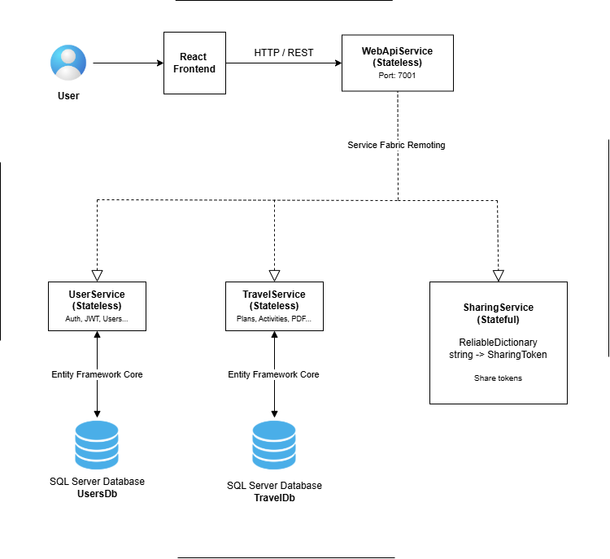

# Travel Planner Web Application

[English](README.md) | **Srpski**

Web aplikacija za planiranje putovanja koja omogućava korisniku da sve bitno za neko putovanje ima na jednom mestu — destinacije, aktivnosti, budžet i checklist — kao i da plan putovanja podeli preko QR koda.

## Sadržaj

- [Funkcionalnosti](#funkcionalnosti)
- [Tehnologije](#tehnologije)
- [Arhitektura](#arhitektura)
- [Preduslovi](#preduslovi)
- [Instalacija](#instalacija)
- [Korišćenje](#korišćenje)
- [Konfiguracija](#konfiguracija)
- [Kontakt](#kontakt)

## Funkcionalnosti

- **Destinacije** – dodavanje i organizovanje mesta koja planirate da posetite
- **Aktivnosti** – planiranje onoga što ćete raditi na putovanju
- **Budžet** – planiranje i praćenje troškova putovanja
- **Checklist** – da ništa ne zaboravite pre polaska
- **Deljenje preko QR koda** – deljenje plana putovanja sa drugima putem QR koda
- **Korisnički nalozi** – registracija i prijava zaštićene JWT autentifikacijom

## Tehnologije

| Sloj            | Tehnologija                            |
| --------------- | -------------------------------------- |
| Frontend        | React (Vite), TypeScript               |
| Backend         | ASP.NET Core, Microsoft Service Fabric |
| Baza podataka   | Microsoft SQL Server                   |
| ORM             | Entity Framework Core                  |
| Autentifikacija | JWT                                    |

## Arhitektura

Backend je realizovan kao Service Fabric aplikacija. React frontend komunicira sa `WebApiService` servisom preko HTTP/REST-a, a on prosleđuje zahteve internim servisima koristeći Service Fabric Remoting.

| Servis           | Tip       | Odgovornost                                          | Skladištenje                                    |
| ---------------- | --------- | ---------------------------------------------------- | ----------------------------------------------- |
| `WebApiService`  | Stateless | Ulazna tačka za frontend (HTTP/REST, port 7001)      | —                                               |
| `UserService`    | Stateless | Korisnički nalozi, autentifikacija i JWT             | `UsersDb` (SQL Server)                          |
| `TravelService`  | Stateless | Planovi putovanja, aktivnosti i izvoz u PDF          | `TravelDb` (SQL Server)                         |
| `SharingService` | Stateful  | Tokeni za deljenje planova putovanja                 | Reliable Dictionary (`string → SharingToken`)   |

### Arhitektura sistema



### Use case dijagram


### Model baze podataka


## Preduslovi

Potrebno je da imate instalirano:

- **Windows** (neophodan za lokalni Service Fabric klaster)
- **Visual Studio 2022** sa *ASP.NET and web development* i *Azure development* workload-ovima
- **.NET 9 SDK**
- **Microsoft Service Fabric SDK** sa pokrenutim lokalnim klasterom
- **Microsoft SQL Server** (Express ili Developer izdanje) i **SQL Server Management Studio (SSMS)**
- **Node.js** (LTS) i **npm**

## Instalacija

### 1. Kloniranje repozitorijuma

```bash
git clone https://github.com/miroslavdispiter/travel-planner-app.git
```

### 2. Kreiranje baza podataka

Otvoriti SQL Server Management Studio i kreirati dve prazne baze podataka:

- `UsersDb`
- `TravelDb`

### 3. Podešavanje servisa

Kreirati ili izmeniti `appsettings.json` fajlove za `UserService`, `TravelService` i `WebApiService`, kao i `.env` fajl za frontend, kako je opisano u sekciji [Konfiguracija](#konfiguracija).

### 4. Primena migracija

1. Otvoriti rešenje u Visual Studio-u.
2. Otvoriti Package Manager Console: **Tools → NuGet Package Manager → Package Manager Console**
3. Izvršiti sledeće komande:

```powershell
Update-Database -Project UserService -StartupProject UserService
Update-Database -Project TravelService -StartupProject TravelService
```

Ove komande će automatski kreirati sve potrebne tabele koristeći postojeće migracije.

### 5. Pokretanje backend-a

1. U Visual Studio-u postaviti Service Fabric projekat kao **Startup Project**.
2. Kliknuti **Run** (ili pritisnuti `F5`).

Backend će biti dostupan na: `https://localhost:7001`

### 6. Pokretanje frontend aplikacije

Proveriti da je `.env` fajl kreiran (videti [Konfiguracija](#konfiguracija)), a zatim pokrenuti:

```bash
cd travel-planner-app/client
npm install
npm run dev
```

## Korišćenje

Kada su backend i frontend pokrenuti:

1. Otvoriti adresu prikazanu u terminalu nakon `npm run dev` (podrazumevano `http://localhost:5173`).
2. Registrovati novi nalog i prijaviti se.
3. Kreirati novo putovanje i dodati destinacije, aktivnosti, stavke budžeta i stavke checklist-e.
4. Podeliti putovanje sa drugima generisanjem QR koda.

## Konfiguracija

> **Napomena:**
> - Zameniti JWT `Secret` sopstvenim nasumičnim stringom od najmanje 32 karaktera. Vrednosti u `JwtSettings` moraju biti iste u `UserService` i `WebApiService`.
> - Proveriti da vrednost `Server` u konekcionim stringovima odgovara vašoj SQL Server instanci (npr. `localhost` za podrazumevanu instancu ili `.\SQLEXPRESS` za SQL Server Express).
> - Ne postavljati prave tajne ključeve u repozitorijum.

### UserService

`UserService/PackageRoot/Config/appsettings.json`

```json
{
  "JwtSettings": {
    "Secret": "your-very-strong-secret-key-min-32-characters-long!",
    "Issuer": "TravelPlannerApp",
    "Audience": "TravelPlannerApp",
    "ExpirationMinutes": 15
  },
  "ConnectionStrings": {
    "DefaultConnection": "Server=.\\SQLEXPRESS;Database=UsersDb;Trusted_Connection=True;TrustServerCertificate=True"
  }
}
```

### TravelService

`TravelService/PackageRoot/Config/appsettings.json`

```json
{
  "ConnectionStrings": {
    "DefaultConnection": "Server=.\\SQLEXPRESS;Database=TravelDb;Trusted_Connection=True;TrustServerCertificate=True"
  }
}
```

### WebApiService

Unutar `Config` foldera projekta `WebApiService` kreirati `appsettings.json` fajl sledećeg sadržaja:

```json
{
  "Logging": {
    "LogLevel": {
      "Default": "Information",
      "Microsoft.AspNetCore": "Warning"
    }
  },
  "AllowedHosts": "*",
  "ConnectionStrings": {
    "TravelDb": "Server=localhost;Database=TravelDb;Trusted_Connection=True;TrustServerCertificate=True;",
    "UsersDb": "Server=localhost;Database=UsersDb;Trusted_Connection=True;TrustServerCertificate=True;"
  },
  "JwtSettings": {
    "Secret": "your-very-strong-secret-key-min-32-characters-long!",
    "Issuer": "TravelPlannerApp",
    "Audience": "TravelPlannerApp",
    "ExpirationMinutes": 15
  }
}
```

### Frontend

U folderu `travel-planner-app/client` kreirati `.env` fajl:

```env
VITE_API_URL=http://localhost:7001/api
```

## Kontakt

**Miroslav Dišpiter**

- GitHub: [@miroslavdispiter](https://github.com/miroslavdispiter)
- Email: miroslav.dispiter.it@gmail.com